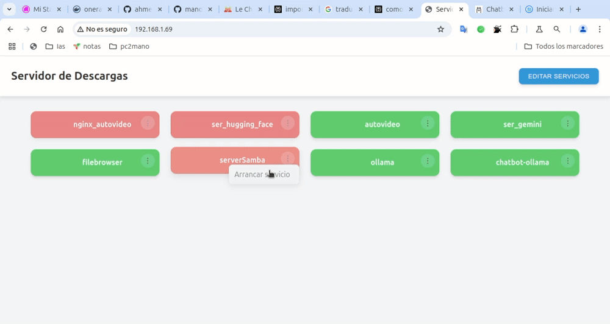

# Simple ui docker

Una aplicación web en Python para gestionar de forma sencilla los contenedores Docker en un servidor.
Permite tener un listados de todos los servicio y acceder a ellos de forma rápida.
Permite iniciar y detener contenedores de manera intuitiva a través de una interfaz web.

<div align="center">
  
</div>

## Características
- Listado de los servicio disponibles.
- Inicio y parada de contenedores con un solo clic.
- Interfaz web amigable y sencilla.
- Diseñado para ejecutarse en servidores locales de aplicaciones.

## Requisitos
- Docker instalado en el servidor

## Instalación

1. **Ejecuta directamente con docker:**

crea primero el archivo de base de datos

    touch data.json

ejecución directa, ejecuta el comando de docker


```
docker run -d --name simple_ui_docker \
  --restart always \
  -p 80:80 \
  -e TITLE="Servidor de Descargas" \
  -v $(pwd)/data.json:/app/data.json \
  -v /var/run/docker.sock:/var/run/docker.sock \
  manologcode/simple_ui_docker

```
Abre el navegador y esta corriendo en http://localhost/

2. **Clonar el repositorio:**

Puedes clonarte el repositorio, y modificarlo

para correrlo en modo desarrollo usa:

```bash
docker-compose up --build
```

